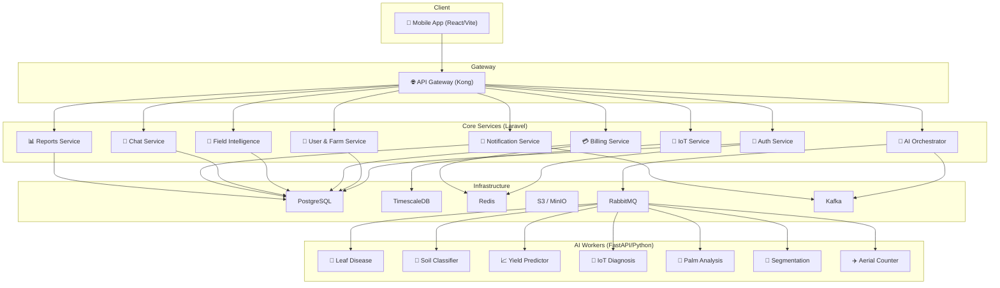

# GeoNutria Backend — Full Implementation Plan

## Overview

Build a production-grade microservices backend to serve the **GeoNutria** mobile app — an AI-powered precision agriculture platform. The frontend is a React/Vite app with 38 screens covering authentication, farm/field management, 7 AI diagnostics tools, IoT sensor monitoring, credit-based billing, chat, reports, and notifications.

This plan is derived from analyzing **every screen in the app** to extract the exact data models, API contracts, and flows required, then mapping them onto the microservices architecture defined in `structure.md`.

---

## User Review Required

> [!IMPORTANT]
> **Technology Decisions Required:**
> 1. **Laravel vs. a lighter framework**: The architecture doc mandates Laravel for all 9 core services. Laravel is heavy for microservices — would you consider **Laravel** for complex services (Auth, Billing, AI Orchestrator) and **Lumen** or **Laravel Zero** for simpler ones (Notification, Reports)?
> 2. **Start with RabbitMQ only?** The doc says "Start simple: Kafka can come later". Shall we defer Kafka to Phase 2 and begin with RabbitMQ only?
> 3. **MongoDB for AI results?** The doc marks this as optional. Shall we use PostgreSQL JSONB columns instead to reduce infrastructure complexity initially?
> 4. **Payment Gateway**: Stripe is mentioned. Do you also need local Saudi gateways (e.g., HyperPay, Moyasar) from day one?
> 5. **AI Models**: Do you have pre-trained models ready, or should AI services start as stub/mock services?

> [!WARNING]
> **Scope Alert**: Building 9 microservices + 7 AI services + infrastructure from scratch is a 4-6 month effort for a team. This plan is phased to deliver a working MVP in **Phase 1-3 (~8-10 weeks)** with the most critical services first.

---

## Architecture Diagram



---

## Phase 1 — Infrastructure & Foundation (Week 1-2)

### 1.1 Monorepo Setup

#### [NEW] `docker-compose.yml` (root)
Master docker-compose for local development orchestrating all services and infrastructure.

#### [NEW] `docker-compose.infra.yml`
Infrastructure-only compose (PostgreSQL, TimescaleDB, Redis, RabbitMQ, MinIO, Kong).

#### [NEW] `.env.example`
Shared environment variable template.

#### [NEW] `Makefile`
Developer convenience commands: `make up`, `make migrate-all`, `make seed-all`, `make test-all`.

**Folder structure:**

```
d:\work\GeoNutria\
├── App/                          # Existing frontend
├── structure.md                  # Architecture doc
├── docker-compose.yml            # Root orchestrator
├── docker-compose.infra.yml      # Infra only
├── gateway/                      # Kong config
│   └── kong.yml
├── auth-service/                 # Laravel
├── user-service/                 # Laravel
├── billing-service/              # Laravel
├── ai-orchestrator/              # Laravel
├── field-service/                # Laravel
├── iot-service/                  # Laravel
├── chat-service/                 # Laravel
├── notification-service/         # Laravel
├── report-service/               # Laravel
├── ai-services/                  # Python/FastAPI
│   ├── leaf-disease/
│   ├── soil-classifier/
│   ├── yield-predictor/
│   ├── iot-diagnosis/
│   ├── palm-analysis/
│   ├── segmentation/
│   └── aerial-counter/
└── shared/                       # Shared proto/schemas
    ├── api-schemas/
    └── events/
```

---

### 1.2 Infrastructure Services

| Service | Image | Port | Purpose |
|---------|-------|------|---------|
| PostgreSQL 16 | `postgres:16-alpine` | 5432 | Core data for all Laravel services |
| TimescaleDB | `timescale/timescaledb:latest-pg16` | 5433 | IoT time-series data |
| Redis 7 | `redis:7-alpine` | 6379 | Sessions, OTP cache, credit locks |
| RabbitMQ | `rabbitmq:3-management` | 5672/15672 | AI job queues |
| MinIO | `minio/minio` | 9000/9001 | S3-compatible file storage |
| Kong Gateway | `kong:3.6` | 8000/8001 | API routing, rate-limiting, JWT |

### 1.3 API Gateway (Kong)

#### [NEW] `gateway/kong.yml`

Route configuration mapping frontend paths to backend services:

| Frontend Path Pattern | Target Service | Port |
|----------------------|----------------|------|
| `/api/v1/auth/*` | auth-service | 8010 |
| `/api/v1/users/*`, `/api/v1/farms/*`, `/api/v1/fields/*` | user-service | 8020 |
| `/api/v1/billing/*`, `/api/v1/subscriptions/*`, `/api/v1/credits/*` | billing-service | 8030 |
| `/api/v1/ai/*` | ai-orchestrator | 8040 |
| `/api/v1/field-intelligence/*`, `/api/v1/crops/*` | field-service | 8050 |
| `/api/v1/iot/*`, `/api/v1/sensors/*` | iot-service | 8060 |
| `/api/v1/chat/*` | chat-service | 8070 |
| `/api/v1/notifications/*` | notification-service | 8080 |
| `/api/v1/reports/*` | report-service | 8090 |

**Gateway features:**
- JWT validation plugin (all routes except `/api/v1/auth/login`, `/api/v1/auth/register`)
- Rate limiting: 100 req/min per user, 1000 req/min per IP
- Request/response transformation for `Accept-Language: ar|en`
- CORS configuration for mobile app
- Request size limit: 10MB (for image uploads)

---

## Phase 2 — Core Services (Week 3-6)

### 2.1 🔐 Auth Service (`auth-service/`)

**Tech:** Laravel 11 + Sanctum + Redis

#### Database Schema (`auth_db`)

```sql
-- users (auth only - minimal profile)
CREATE TABLE users (
    id UUID PRIMARY KEY DEFAULT gen_random_uuid(),
    email VARCHAR(255) UNIQUE NOT NULL,
    phone VARCHAR(20),
    password_hash VARCHAR(255) NOT NULL,
    role ENUM('owner', 'agronomist', 'technician') DEFAULT 'owner',
    email_verified_at TIMESTAMP,
    is_active BOOLEAN DEFAULT true,
    last_login_at TIMESTAMP,
    created_at TIMESTAMP DEFAULT NOW(),
    updated_at TIMESTAMP DEFAULT NOW()
);

-- otp_codes
CREATE TABLE otp_codes (
    id SERIAL PRIMARY KEY,
    user_id UUID REFERENCES users(id),
    code VARCHAR(6) NOT NULL,
    type ENUM('email_verification', 'password_reset', 'phone_verification'),
    expires_at TIMESTAMP NOT NULL,
    used_at TIMESTAMP,
    created_at TIMESTAMP DEFAULT NOW()
);

-- refresh_tokens
CREATE TABLE refresh_tokens (
    id UUID PRIMARY KEY DEFAULT gen_random_uuid(),
    user_id UUID REFERENCES users(id),
    token_hash VARCHAR(255) NOT NULL,
    device_name VARCHAR(100),
    expires_at TIMESTAMP NOT NULL,
    revoked_at TIMESTAMP,
    created_at TIMESTAMP DEFAULT NOW()
);
```

#### API Endpoints (derived from Login.tsx, Signup.tsx, Security.tsx)

```
POST   /api/v1/auth/register          # name, email, password, farmName → JWT + user
POST   /api/v1/auth/login             # email, password → JWT + refresh_token
POST   /api/v1/auth/logout            # Revoke current token
POST   /api/v1/auth/refresh           # refresh_token → new JWT
POST   /api/v1/auth/forgot-password   # email → send OTP
POST   /api/v1/auth/reset-password    # email, otp, new_password
POST   /api/v1/auth/verify-otp        # code → verify
PUT    /api/v1/auth/change-password   # old_password, new_password
GET    /api/v1/auth/me                # Current user info
DELETE /api/v1/auth/account           # Soft-delete account (Settings.tsx)
GET    /api/v1/auth/devices           # Connected devices list (Settings.tsx)
DELETE /api/v1/auth/devices/:id       # Revoke device session
POST   /api/v1/auth/2fa/enable        # Enable 2FA (Security.tsx)
POST   /api/v1/auth/2fa/verify        # Verify 2FA code
```

**Events emitted (Kafka):**
- `user.created` → triggers User Service to create profile + Billing Service to create wallet
- `user.deleted`
- `user.login`

---

### 2.2 👤 User & Farm Service (`user-service/`)

**Tech:** Laravel 11 + PostgreSQL

#### Database Schema (`user_db`)

```sql
-- profiles
CREATE TABLE profiles (
    id UUID PRIMARY KEY DEFAULT gen_random_uuid(),
    user_id UUID UNIQUE NOT NULL,  -- from Auth Service
    full_name VARCHAR(255) NOT NULL,
    avatar_url VARCHAR(500),
    phone VARCHAR(20),
    location VARCHAR(255),
    language ENUM('en', 'ar') DEFAULT 'en',
    created_at TIMESTAMP DEFAULT NOW(),
    updated_at TIMESTAMP DEFAULT NOW()
);

-- farms
CREATE TABLE farms (
    id UUID PRIMARY KEY DEFAULT gen_random_uuid(),
    user_id UUID NOT NULL,
    name VARCHAR(255) NOT NULL,
    size_hectares DECIMAL(10,2),
    location VARCHAR(255),
    latitude DECIMAL(10,8),
    longitude DECIMAL(11,8),
    crop_types TEXT,                    -- comma-separated or JSON
    established_date DATE,
    created_at TIMESTAMP DEFAULT NOW(),
    updated_at TIMESTAMP DEFAULT NOW()
);

-- fields
CREATE TABLE fields (
    id UUID PRIMARY KEY DEFAULT gen_random_uuid(),
    farm_id UUID REFERENCES farms(id) ON DELETE CASCADE,
    name VARCHAR(255) NOT NULL,
    size_hectares DECIMAL(10,2),
    crop_type VARCHAR(100),
    zone VARCHAR(100),
    status ENUM('healthy', 'moderate', 'attention') DEFAULT 'healthy',
    planting_date DATE,
    latitude DECIMAL(10,8),
    longitude DECIMAL(11,8),
    created_at TIMESTAMP DEFAULT NOW(),
    updated_at TIMESTAMP DEFAULT NOW()
);

-- sensors (assigned to fields)
CREATE TABLE sensors (
    id UUID PRIMARY KEY DEFAULT gen_random_uuid(),
    field_id UUID REFERENCES fields(id) ON DELETE SET NULL,
    sensor_external_id VARCHAR(100) UNIQUE NOT NULL,  -- e.g., "SENSOR-001"
    type VARCHAR(50),
    status ENUM('online', 'offline', 'maintenance') DEFAULT 'offline',
    last_reading_at TIMESTAMP,
    created_at TIMESTAMP DEFAULT NOW(),
    updated_at TIMESTAMP DEFAULT NOW()
);
```

#### API Endpoints (derived from Profile.tsx, EditProfile.tsx, FarmDetails.tsx, Fields.tsx, AddField.tsx, FieldDetail.tsx)

```
# Profile
GET    /api/v1/users/profile              # Full profile with stats
PUT    /api/v1/users/profile              # Update name, phone, location
POST   /api/v1/users/profile/avatar       # Upload avatar image

# Farm
GET    /api/v1/farms                       # List user farms
POST   /api/v1/farms                       # Create farm (farmName, size, location, cropTypes, date)
GET    /api/v1/farms/:id                   # Farm details + stats
PUT    /api/v1/farms/:id                   # Update farm
GET    /api/v1/farms/:id/stats             # Total fields, active crops, sensors, years

# Fields
GET    /api/v1/farms/:farmId/fields        # List fields with sensor status & moisture
POST   /api/v1/farms/:farmId/fields        # Create field (name, size, cropType, zone, sensorId, date)
GET    /api/v1/fields/:id                  # Field detail + current readings
PUT    /api/v1/fields/:id                  # Update field
DELETE /api/v1/fields/:id                  # Delete field
GET    /api/v1/fields/:id/history          # Field action history (fertilizer, irrigation, etc.)
GET    /api/v1/fields/:id/diagnoses        # Past diagnoses for this field

# Sensors
POST   /api/v1/sensors/register            # Register sensor to field
PUT    /api/v1/sensors/:id/assign          # Assign/reassign sensor to field
GET    /api/v1/sensors/:id/status          # Sensor online/offline status
```

---

### 2.3 💳 Billing & Subscription Service (`billing-service/`)

**Tech:** Laravel 11 + PostgreSQL + Redis (locks) + Stripe

> [!IMPORTANT]
> This is the **money engine**. All credit operations MUST be atomic with database transactions + Redis locks.

#### Database Schema (`billing_db`)

```sql
-- plans
CREATE TABLE plans (
    id UUID PRIMARY KEY DEFAULT gen_random_uuid(),
    slug VARCHAR(50) UNIQUE NOT NULL,  -- 'free', 'basic', 'pro', 'enterprise'
    name VARCHAR(100) NOT NULL,
    name_ar VARCHAR(100),
    price_monthly DECIMAL(10,2) NOT NULL,
    price_yearly DECIMAL(10,2) NOT NULL,
    credits_per_month INT NOT NULL,
    max_farms INT,
    features JSONB,                      -- feature flags
    is_active BOOLEAN DEFAULT true,
    sort_order INT DEFAULT 0,
    created_at TIMESTAMP DEFAULT NOW()
);

-- subscriptions
CREATE TABLE subscriptions (
    id UUID PRIMARY KEY DEFAULT gen_random_uuid(),
    user_id UUID NOT NULL,
    plan_id UUID REFERENCES plans(id),
    status ENUM('active', 'cancelled', 'expired', 'past_due') DEFAULT 'active',
    billing_cycle ENUM('monthly', 'yearly') DEFAULT 'monthly',
    stripe_subscription_id VARCHAR(255),
    current_period_start TIMESTAMP,
    current_period_end TIMESTAMP,
    cancelled_at TIMESTAMP,
    created_at TIMESTAMP DEFAULT NOW(),
    updated_at TIMESTAMP DEFAULT NOW()
);

-- credit_wallets
CREATE TABLE credit_wallets (
    id UUID PRIMARY KEY DEFAULT gen_random_uuid(),
    user_id UUID UNIQUE NOT NULL,
    balance INT NOT NULL DEFAULT 0,
    total_earned INT NOT NULL DEFAULT 0,
    total_spent INT NOT NULL DEFAULT 0,
    last_reset_at TIMESTAMP,
    next_reset_at TIMESTAMP,
    created_at TIMESTAMP DEFAULT NOW(),
    updated_at TIMESTAMP DEFAULT NOW()
);

-- credit_transactions
CREATE TABLE credit_transactions (
    id UUID PRIMARY KEY DEFAULT gen_random_uuid(),
    wallet_id UUID REFERENCES credit_wallets(id),
    user_id UUID NOT NULL,
    type ENUM('deduction', 'addition', 'refund', 'reset', 'purchase') NOT NULL,
    amount INT NOT NULL,
    balance_after INT NOT NULL,
    feature VARCHAR(100),               -- 'leaf_scan', 'soil_scan', 'ai_chat', etc.
    reference_id UUID,                  -- AI job ID or purchase ID
    description VARCHAR(255),
    created_at TIMESTAMP DEFAULT NOW()
);

-- credit_packages (for one-time purchases)
CREATE TABLE credit_packages (
    id UUID PRIMARY KEY DEFAULT gen_random_uuid(),
    credits INT NOT NULL,
    bonus_credits INT DEFAULT 0,
    price DECIMAL(10,2) NOT NULL,
    is_popular BOOLEAN DEFAULT false,
    is_active BOOLEAN DEFAULT true,
    sort_order INT DEFAULT 0,
    created_at TIMESTAMP DEFAULT NOW()
);

-- feature_costs (credit cost per AI feature)
CREATE TABLE feature_costs (
    id SERIAL PRIMARY KEY,
    feature_key VARCHAR(100) UNIQUE NOT NULL,
    cost INT NOT NULL,
    description VARCHAR(255),
    description_ar VARCHAR(255)
);

-- Seed data for feature_costs:
-- iot_diagnosis: 2, leaf_scan: 3, soil_scan: 3, ai_chat: 1,
-- yield_prediction: 5, palm_counter: 6, palm_segmentation: 4,
-- palm_disease: 3, leaf_segmentation: 4, crop_recommendation: 3
```

#### API Endpoints (derived from Subscription.tsx, Credits.tsx, BuyCredits.tsx)

```
# Plans
GET    /api/v1/billing/plans               # List all plans with features

# Subscription
GET    /api/v1/subscriptions/current        # Current subscription + plan info
POST   /api/v1/subscriptions/upgrade        # planId, billingCycle → Stripe checkout
POST   /api/v1/subscriptions/downgrade      # planId
POST   /api/v1/subscriptions/cancel         # Cancel at period end
POST   /api/v1/subscriptions/webhook        # Stripe webhook handler

# Credits
GET    /api/v1/credits/wallet               # Balance, renewal date, total stats
GET    /api/v1/credits/transactions          # Transaction history (paginated)
GET    /api/v1/credits/usage                 # Weekly usage chart data
GET    /api/v1/credits/feature-costs         # Cost per feature map
POST   /api/v1/credits/check                # Check if user has enough for feature
POST   /api/v1/credits/deduct               # Internal: atomic deduction (called by AI Orchestrator)
POST   /api/v1/credits/refund               # Internal: refund on AI failure

# Packages
GET    /api/v1/credits/packages              # List purchasable credit packages
POST   /api/v1/credits/purchase              # packageId → Stripe payment → add credits
```

**Credit Deduction Flow (middleware):**
```
1. Lock wallet (Redis: "wallet_lock:{user_id}" with 10s TTL)
2. Check balance >= cost
3. BEGIN TRANSACTION
4.   UPDATE credit_wallets SET balance = balance - cost
5.   INSERT INTO credit_transactions (type: 'deduction', amount: cost, feature: X)
6. COMMIT
7. Release lock
8. Emit event: credits.used
```

---

### 2.4 🤖 AI Orchestrator Service (`ai-orchestrator/`)

**Tech:** Laravel 11 + RabbitMQ + Redis

This is the **controller layer** for all AI operations. It does NOT run any ML models.

#### Database Schema (`ai_orchestrator_db`)

```sql
-- ai_jobs
CREATE TABLE ai_jobs (
    id UUID PRIMARY KEY DEFAULT gen_random_uuid(),
    user_id UUID NOT NULL,
    field_id UUID,
    type ENUM(
        'leaf_disease', 'soil_classifier', 'yield_prediction',
        'iot_diagnosis', 'palm_disease', 'palm_segmentation',
        'leaf_segmentation', 'palm_counter', 'crop_recommendation'
    ) NOT NULL,
    status ENUM('pending', 'processing', 'completed', 'failed') DEFAULT 'pending',
    input_data JSONB,                   -- sensor values, selected field, crop, etc.
    input_image_url VARCHAR(500),       -- S3 URL for image-based jobs
    result JSONB,                       -- AI result stored here
    credits_charged INT,
    error_message TEXT,
    started_at TIMESTAMP,
    completed_at TIMESTAMP,
    created_at TIMESTAMP DEFAULT NOW(),
    updated_at TIMESTAMP DEFAULT NOW()
);
```

#### API Endpoints (derived from all diagnostic screens)

```
# Upload
POST   /api/v1/ai/upload                   # Upload image → S3 → return URL

# AI Jobs
POST   /api/v1/ai/leaf-disease             # image_url → job_id (3 credits)
POST   /api/v1/ai/soil-classifier          # image_url → job_id (3 credits)
POST   /api/v1/ai/yield-prediction         # field_id, crop → job_id (5 credits)
POST   /api/v1/ai/iot-diagnosis            # sensor_data{11 params} → job_id (2 credits)
POST   /api/v1/ai/palm-disease             # image_url → job_id (3 credits)
POST   /api/v1/ai/palm-segmentation        # image_url → job_id (4 credits)
POST   /api/v1/ai/leaf-segmentation        # image_url → job_id (4 credits)
POST   /api/v1/ai/palm-counter             # image_url → job_id (6 credits)
POST   /api/v1/ai/crop-recommendation      # field_id, soil_data → job_id (3 credits)

# Job Status
GET    /api/v1/ai/jobs/:id                 # Poll job status + result
GET    /api/v1/ai/jobs                     # List user's recent jobs (paginated)

# Results (specific response shapes per type)
GET    /api/v1/ai/jobs/:id/result          # Full result with recommendations
```

**AI Job Flow:**
```
1. Validate request
2. Call Billing Service: POST /credits/check → sufficient?
3. Call Billing Service: POST /credits/deduct → atomic deduction
4. Upload image to S3 (if image-based)
5. Create ai_jobs record (status: pending)
6. Publish to RabbitMQ queue: ai.{type} with job_id + input_data
7. Return job_id to client (202 Accepted)
8. Client polls GET /ai/jobs/:id until status = completed

--- Worker side ---
9. AI Worker consumes from queue
10. Processes input → ML inference
11. Calls back: PUT /ai/jobs/:id/result (internal endpoint)
12. Orchestrator updates job → Emits Kafka event: ai.completed
13. Triggers notification to user
14. If worker fails → emit ai.failed → trigger credit refund
```

**RabbitMQ Queues:**

| Queue Name | Consumer | Priority |
|------------|----------|----------|
| `ai.leaf_disease` | ai-leaf-disease-service | Normal |
| `ai.soil_classifier` | ai-soil-classifier | Normal |
| `ai.yield_prediction` | ai-yield-predictor | Normal |
| `ai.iot_diagnosis` | ai-iot-diagnosis | High |
| `ai.palm_disease` | ai-palm-analysis | Normal |
| `ai.palm_segmentation` | ai-segmentation-service | Normal |
| `ai.leaf_segmentation` | ai-segmentation-service | Normal |
| `ai.palm_counter` | ai-aerial-counter | Low |
| `ai.crop_recommendation` | ai-yield-predictor | Normal |

---

### 2.5 🌱 Field Intelligence Service (`field-service/`)

**Tech:** Laravel 11 + PostgreSQL

#### Database Schema (`field_intelligence_db`)

```sql
-- crop_data
CREATE TABLE crop_data (
    id UUID PRIMARY KEY DEFAULT gen_random_uuid(),
    field_id UUID NOT NULL,
    crop_type VARCHAR(100),
    growth_stage VARCHAR(50),
    health_score DECIMAL(5,2),         -- 0-100
    planting_date DATE,
    expected_harvest DATE,
    created_at TIMESTAMP DEFAULT NOW(),
    updated_at TIMESTAMP DEFAULT NOW()
);

-- field_recommendations
CREATE TABLE field_recommendations (
    id UUID PRIMARY KEY DEFAULT gen_random_uuid(),
    field_id UUID NOT NULL,
    type ENUM('irrigation', 'fertilizer', 'pest_control', 'general'),
    title VARCHAR(255) NOT NULL,
    description TEXT,
    priority ENUM('low', 'medium', 'high') DEFAULT 'medium',
    source VARCHAR(50),                -- 'ai', 'iot', 'manual'
    ai_job_id UUID,
    is_read BOOLEAN DEFAULT false,
    created_at TIMESTAMP DEFAULT NOW()
);

-- yield_results
CREATE TABLE yield_results (
    id UUID PRIMARY KEY DEFAULT gen_random_uuid(),
    field_id UUID NOT NULL,
    crop_type VARCHAR(100),
    predicted_yield DECIMAL(10,2),
    yield_unit VARCHAR(20),            -- 'kg/hectare', 'tons'
    confidence DECIMAL(5,2),
    factors JSONB,                     -- contributing factors
    ai_job_id UUID,
    created_at TIMESTAMP DEFAULT NOW()
);

-- field_history (timeline events)
CREATE TABLE field_events (
    id UUID PRIMARY KEY DEFAULT gen_random_uuid(),
    field_id UUID NOT NULL,
    event_type VARCHAR(50),            -- 'fertilizer', 'irrigation', 'treatment', 'planting'
    title VARCHAR(255),
    details TEXT,
    date DATE NOT NULL,
    created_at TIMESTAMP DEFAULT NOW()
);

-- crop_health_trend (daily snapshot)
CREATE TABLE crop_health_daily (
    id SERIAL PRIMARY KEY,
    field_id UUID NOT NULL,
    date DATE NOT NULL,
    health_score DECIMAL(5,2),
    UNIQUE(field_id, date)
);
```

#### API Endpoints (derived from Home.tsx, FieldDetail.tsx, CropRecommendation/Result, YieldPrediction/Result)

```
# Crop Health
GET    /api/v1/field-intelligence/:fieldId/health           # Current health score
GET    /api/v1/field-intelligence/:fieldId/health-trend     # 7-day trend (for chart)
GET    /api/v1/field-intelligence/farm-health               # Aggregated farm KPIs

# Recommendations
GET    /api/v1/field-intelligence/:fieldId/recommendations  # Active recommendations
POST   /api/v1/field-intelligence/:fieldId/recommendations  # Create manual recommendation
PUT    /api/v1/field-intelligence/recommendations/:id/read  # Mark as read

# Yield
GET    /api/v1/field-intelligence/:fieldId/yield-history    # Past yield predictions
GET    /api/v1/field-intelligence/yield/:jobId              # Specific yield result

# Events / History
GET    /api/v1/field-intelligence/:fieldId/events           # Field timeline
POST   /api/v1/field-intelligence/:fieldId/events           # Log field event

# Home Dashboard
GET    /api/v1/field-intelligence/dashboard                 # KPIs: active fields, alerts, palm count, sensor health
GET    /api/v1/field-intelligence/recent-activity           # Recent scans, readings, alerts
```

---

### 2.6 📡 IoT Service (`iot-service/`)

**Tech:** Laravel 11 + TimescaleDB + MQTT (Mosquitto)

#### Database Schema (`iot_db` — TimescaleDB)

```sql
-- sensor_readings (hypertable — time-series)
CREATE TABLE sensor_readings (
    time TIMESTAMPTZ NOT NULL,
    sensor_id UUID NOT NULL,
    field_id UUID NOT NULL,
    moisture DECIMAL(5,2),
    ambient_temp DECIMAL(5,2),
    soil_temp DECIMAL(5,2),
    humidity DECIMAL(5,2),
    light DECIMAL(10,2),
    ph DECIMAL(4,2),
    nitrogen DECIMAL(8,2),
    phosphorus DECIMAL(8,2),
    potassium DECIMAL(8,2),
    chlorophyll DECIMAL(8,2),
    ec DECIMAL(6,3)
);

-- Convert to hypertable
SELECT create_hypertable('sensor_readings', 'time');

-- sensor_thresholds
CREATE TABLE sensor_thresholds (
    id SERIAL PRIMARY KEY,
    field_id UUID NOT NULL,
    parameter VARCHAR(50) NOT NULL,
    min_value DECIMAL(10,2),
    max_value DECIMAL(10,2),
    alert_enabled BOOLEAN DEFAULT true
);

-- sensor_alerts
CREATE TABLE sensor_alerts (
    id UUID PRIMARY KEY DEFAULT gen_random_uuid(),
    sensor_id UUID NOT NULL,
    field_id UUID NOT NULL,
    parameter VARCHAR(50),
    value DECIMAL(10,2),
    threshold_type ENUM('above_max', 'below_min'),
    acknowledged BOOLEAN DEFAULT false,
    created_at TIMESTAMPTZ DEFAULT NOW()
);
```

#### API Endpoints (derived from IoTDiagnosis.tsx, FieldDetail.tsx)

```
# Readings
GET    /api/v1/iot/fields/:fieldId/readings          # Latest readings (11 params)
GET    /api/v1/iot/fields/:fieldId/readings/history   # Time-series data for charts
POST   /api/v1/iot/readings                           # Ingest sensor data (HTTP)
# (Also: MQTT topic: geonutria/sensors/{sensor_id}/data)

# Sensors
GET    /api/v1/iot/sensors                            # List user's sensors
GET    /api/v1/iot/sensors/:id/status                 # Online/offline + last reading

# Thresholds & Alerts
GET    /api/v1/iot/fields/:fieldId/thresholds         # Get alert thresholds
PUT    /api/v1/iot/fields/:fieldId/thresholds         # Update thresholds
GET    /api/v1/iot/alerts                             # Active alerts
PUT    /api/v1/iot/alerts/:id/acknowledge             # Acknowledge alert
```

---

### 2.7 💬 AI Chat Service (`chat-service/`)

**Tech:** Laravel 11 + PostgreSQL + OpenAI/LLM API

#### Database Schema (`chat_db`)

```sql
-- chat_sessions
CREATE TABLE chat_sessions (
    id UUID PRIMARY KEY DEFAULT gen_random_uuid(),
    user_id UUID NOT NULL,
    title VARCHAR(255),
    context JSONB,                      -- injected farm/field/diagnosis data
    is_active BOOLEAN DEFAULT true,
    created_at TIMESTAMP DEFAULT NOW(),
    updated_at TIMESTAMP DEFAULT NOW()
);

-- chat_messages
CREATE TABLE chat_messages (
    id UUID PRIMARY KEY DEFAULT gen_random_uuid(),
    session_id UUID REFERENCES chat_sessions(id) ON DELETE CASCADE,
    role ENUM('user', 'assistant', 'system') NOT NULL,
    content TEXT NOT NULL,
    credit_charged INT DEFAULT 0,
    attachments JSONB,                  -- image URLs, file references
    created_at TIMESTAMP DEFAULT NOW()
);
```

#### API Endpoints (derived from AIConsultant.tsx)

```
# Sessions
GET    /api/v1/chat/sessions                    # List chat sessions
POST   /api/v1/chat/sessions                    # Create new session with context
GET    /api/v1/chat/sessions/:id                # Get session with messages
DELETE /api/v1/chat/sessions/:id                # Delete session

# Messages
POST   /api/v1/chat/sessions/:id/messages       # Send message (1 credit) → AI response
GET    /api/v1/chat/sessions/:id/messages        # Message history (paginated)

# Context
POST   /api/v1/chat/sessions/:id/context        # Inject field/diagnosis context
GET    /api/v1/chat/suggested-prompts            # Suggested questions based on context
```

**Chat Flow:**
```
1. User sends message
2. Deduct 1 credit (call Billing Service)
3. Build prompt: system_prompt + farm_context + message_history + user_message
4. Call LLM API (OpenAI/Claude/local model)
5. Store both messages in DB
6. Return assistant response
```

---

### 2.8 🔔 Notification Service (`notification-service/`)

**Tech:** Laravel 11 + Firebase Cloud Messaging + PostgreSQL

#### Database Schema (`notification_db`)

```sql
-- notifications
CREATE TABLE notifications (
    id UUID PRIMARY KEY DEFAULT gen_random_uuid(),
    user_id UUID NOT NULL,
    type ENUM('alert', 'info', 'success', 'system') NOT NULL,
    title VARCHAR(255) NOT NULL,
    title_ar VARCHAR(255),
    message TEXT NOT NULL,
    message_ar TEXT,
    priority ENUM('low', 'medium', 'high') DEFAULT 'medium',
    is_read BOOLEAN DEFAULT false,
    data JSONB,                         -- deep-link data, field_id, report_id, etc.
    created_at TIMESTAMP DEFAULT NOW()
);

-- push_tokens
CREATE TABLE push_tokens (
    id SERIAL PRIMARY KEY,
    user_id UUID NOT NULL,
    token VARCHAR(500) NOT NULL,
    platform ENUM('android', 'ios', 'web') NOT NULL,
    is_active BOOLEAN DEFAULT true,
    created_at TIMESTAMP DEFAULT NOW()
);

-- notification_preferences
CREATE TABLE notification_preferences (
    id SERIAL PRIMARY KEY,
    user_id UUID UNIQUE NOT NULL,
    push_enabled BOOLEAN DEFAULT true,
    email_enabled BOOLEAN DEFAULT true,
    disease_alerts BOOLEAN DEFAULT true,
    iot_alerts BOOLEAN DEFAULT true,
    credit_alerts BOOLEAN DEFAULT true,
    report_ready BOOLEAN DEFAULT true
);
```

#### API Endpoints (derived from Notifications.tsx, Settings.tsx)

```
GET    /api/v1/notifications                    # List notifications (paginated, filtered by type)
GET    /api/v1/notifications/unread-count       # Badge count
PUT    /api/v1/notifications/:id/read           # Mark as read
PUT    /api/v1/notifications/read-all           # Mark all as read
DELETE /api/v1/notifications/:id                # Delete notification

# Preferences
GET    /api/v1/notifications/preferences        # Get notification settings
PUT    /api/v1/notifications/preferences        # Update settings

# Push tokens
POST   /api/v1/notifications/tokens             # Register push token
DELETE /api/v1/notifications/tokens/:id         # Unregister token
```

**Kafka event consumers:**
- `ai.completed` → "Analysis Complete: Your {type} analysis is ready"
- `ai.failed` → "Analysis Failed: Credits refunded"
- `sensor.alert` → "IoT Alert: {field} {parameter} is {value}"
- `credits.low` → "Credit Reminder: You have {balance} credits remaining"

---

### 2.9 📊 Reports Service (`report-service/`)

**Tech:** Laravel 11 + PostgreSQL + DomPDF (for PDF generation)

#### Database Schema (`report_db`)

```sql
-- reports
CREATE TABLE reports (
    id UUID PRIMARY KEY DEFAULT gen_random_uuid(),
    user_id UUID NOT NULL,
    title VARCHAR(255) NOT NULL,
    type ENUM('diagnostic', 'field', 'iot', 'analysis') NOT NULL,
    status ENUM('completed', 'in-progress', 'urgent') DEFAULT 'completed',
    field_id UUID,
    field_name VARCHAR(255),
    summary TEXT,
    data JSONB,                         -- full report data
    pdf_url VARCHAR(500),               -- S3 URL for generated PDF
    ai_job_id UUID,
    created_at TIMESTAMP DEFAULT NOW(),
    updated_at TIMESTAMP DEFAULT NOW()
);

-- report_sections (for detailed reports)
CREATE TABLE report_sections (
    id SERIAL PRIMARY KEY,
    report_id UUID REFERENCES reports(id) ON DELETE CASCADE,
    title VARCHAR(255),
    content TEXT,
    chart_data JSONB,
    sort_order INT DEFAULT 0
);
```

#### API Endpoints (derived from Reports.tsx, ReportDetail.tsx)

```
GET    /api/v1/reports                         # List reports (paginated, filtered by type/status)
GET    /api/v1/reports/:id                     # Full report with sections
GET    /api/v1/reports/stats                   # Total reports, urgent count
GET    /api/v1/reports/:id/pdf                 # Download/generate PDF
POST   /api/v1/reports/export                  # Bulk export reports
POST   /api/v1/reports                         # Internal: create report from AI result
```

---

## Phase 3 — AI Worker Services (Week 7-8)

### 3.1 AI Service Template (FastAPI/Python)

Each AI service follows the same structure:

```
ai-services/{name}/
├── app/
│   ├── main.py              # FastAPI app
│   ├── worker.py            # RabbitMQ consumer
│   ├── model.py             # ML model loader & inference
│   ├── schemas.py           # Pydantic request/response schemas
│   └── config.py            # Environment config
├── models/                  # Trained model files (.h5, .pt, .onnx)
├── Dockerfile
├── requirements.txt
└── tests/
```

**Worker pattern (shared across all AI services):**

```python
# worker.py (template)
import pika, json, requests

def process_job(channel, method, properties, body):
    job = json.loads(body)
    job_id = job["job_id"]
    
    try:
        # 1. Download input (image from S3 or sensor data)
        input_data = prepare_input(job["input_data"])
        
        # 2. Run inference
        result = model.predict(input_data)
        
        # 3. Report result back to Orchestrator
        requests.put(
            f"{ORCHESTRATOR_URL}/api/internal/ai/jobs/{job_id}/result",
            json={"status": "completed", "result": result}
        )
    except Exception as e:
        requests.put(
            f"{ORCHESTRATOR_URL}/api/internal/ai/jobs/{job_id}/result",
            json={"status": "failed", "error": str(e)}
        )
    
    channel.basic_ack(delivery_tag=method.delivery_tag)
```

### 3.2 Individual AI Services

#### 🍃 `ai-leaf-disease-service`
- **Input:** Leaf image (JPEG/PNG)
- **Output:** `{ disease_name, scientific_name, category, confidence, severity, symptoms[], recommendations[], conditions }`
- **Model:** Image classification (ResNet/EfficientNet fine-tuned on PlantVillage dataset)

#### 🧪 `ai-soil-classifier`
- **Input:** Soil image
- **Output:** `{ soil_type, ph, nitrogen_level, description, recommendations[] }`
- **Model:** Image classification + regression

#### 📈 `ai-yield-predictor` (also handles crop recommendation)
- **Input:** `{ field_id, crop_type, soil_data, weather_data, historical_yields }`
- **Output:** `{ predicted_yield, unit, confidence, factors[], monthly_forecast[] }`
- **Model:** Gradient boosting / LSTM time-series

#### 📡 `ai-iot-diagnosis`
- **Input:** 11 sensor parameters (moisture, temps, humidity, light, pH, N, P, K, chlorophyll, EC)
- **Output:** `{ overall_health, score, parameter_analysis[], recommendations[], alerts[] }`
- **Model:** Ensemble classifier + rule engine

#### 🌴 `ai-palm-analysis` (disease detection)
- **Input:** Palm tree image
- **Output:** `{ disease_name, confidence, severity, recommendations[] }`
- **Model:** CNN fine-tuned on palm disease dataset

#### 🔬 `ai-segmentation-service` (leaf + palm segmentation)
- **Input:** Image (leaf or palm)
- **Output:** `{ segmented_image_url, regions[], area_percentages }`
- **Model:** U-Net / DeepLabV3

#### ✈️ `ai-aerial-counter`
- **Input:** Drone/aerial image
- **Output:** `{ tree_count, locations[], annotated_image_url, new_growths }`
- **Model:** Object detection (YOLO / Faster R-CNN)

---

## Phase 4 — Messaging & Event System (Week 9)

### 4.1 RabbitMQ Configuration

**Exchanges:**
- `ai.jobs` (direct exchange) → routes to individual AI queues

**Queues:**
| Queue | Routing Key | Consumer | DLQ |
|-------|------------|----------|-----|
| `ai.leaf_disease` | `leaf_disease` | leaf-disease-service | `ai.leaf_disease.dlq` |
| `ai.soil_classifier` | `soil_classifier` | soil-classifier | `ai.soil_classifier.dlq` |
| `ai.yield_prediction` | `yield_prediction` | yield-predictor | `ai.yield_prediction.dlq` |
| `ai.iot_diagnosis` | `iot_diagnosis` | iot-diagnosis | `ai.iot_diagnosis.dlq` |
| `ai.palm_disease` | `palm_disease` | palm-analysis | `ai.palm_disease.dlq` |
| `ai.segmentation` | `segmentation` | segmentation-service | `ai.segmentation.dlq` |
| `ai.palm_counter` | `palm_counter` | aerial-counter | `ai.palm_counter.dlq` |

**Dead letter queues (DLQ):** Failed jobs after 3 retries → DLQ → alert + credit refund.

### 4.2 Kafka Topics (Phase 2 — can defer)

| Topic | Producers | Consumers |
|-------|-----------|-----------|
| `user.events` | Auth Service | User Service, Billing Service |
| `credits.events` | Billing Service | Notification Service, Analytics |
| `ai.events` | AI Orchestrator | Notification, Report, Field Intelligence |
| `sensor.events` | IoT Service | Notification, Field Intelligence |

---

## Phase 5 — DevOps & Deployment (Week 10)

### 5.1 Docker

Each service gets a multi-stage Dockerfile:

```dockerfile
# Laravel services
FROM composer:2 AS deps
WORKDIR /app
COPY composer.json composer.lock ./
RUN composer install --no-dev --no-scripts

FROM php:8.3-fpm-alpine
# Install extensions: pdo_pgsql, redis, pcntl, amqp
COPY --from=deps /app/vendor /var/www/vendor
COPY . /var/www
CMD ["php-fpm"]

# Python AI services
FROM python:3.11-slim
WORKDIR /app
COPY requirements.txt .
RUN pip install --no-cache-dir -r requirements.txt
COPY . .
CMD ["python", "-m", "app.worker"]
```

### 5.2 Kubernetes (Production)

**Namespaces:**
- `geo-gateway` — Kong + Ingress
- `geo-auth` — Auth Service
- `geo-core` — User, Field, Report services
- `geo-billing` — Billing Service
- `geo-ai` — AI Orchestrator + AI Workers
- `geo-iot` — IoT Service + TimescaleDB
- `geo-messaging` — RabbitMQ, Kafka
- `geo-data` — PostgreSQL, Redis, MinIO
- `geo-monitoring` — Prometheus, Grafana, ELK

**HPA (Horizontal Pod Autoscaler):**

| Service | Min | Max | Scaling Metric |
|---------|-----|-----|----------------|
| Auth | 2 | 5 | CPU 70% |
| User/Farm | 2 | 5 | CPU 70% |
| Billing | 2 | 4 | CPU 60% |
| AI Orchestrator | 2 | 8 | CPU 70% |
| AI Workers | 1 | 10 | RabbitMQ queue depth |
| IoT | 2 | 10 | CPU 70% + throughput |
| Chat | 2 | 6 | CPU 70% |
| Notification | 1 | 3 | CPU 50% |
| Reports | 1 | 3 | CPU 50% |

### 5.3 CI/CD (GitHub Actions)

```yaml
# .github/workflows/deploy.yml (per service)
on:
  push:
    paths: ['{service-name}/**']
    
jobs:
  test:    # PHPUnit / pytest
  build:   # Docker build + push to registry
  deploy:  # kubectl apply to K8s
```

---

## Phase 6 — Observability & Security (Week 10-11)

### 6.1 Monitoring Stack

- **Prometheus** — metrics scraping from all services
- **Grafana** — dashboards for:
  - AI latency per model type
  - Credit usage patterns
  - RabbitMQ queue depths
  - Service error rates
  - Database connection pools
- **ELK Stack** — centralized logging

### 6.2 Security

- API Gateway: JWT validation on all routes
- Internal communication: service-to-service tokens (short-lived, rotating)
- S3 uploads: presigned URLs (10 min expiry)
- Database: per-service credentials, encrypted at rest
- Secrets: Kubernetes Secrets / HashiCorp Vault
- Rate limiting: per-user + per-IP at gateway level

---

## Open Questions

> [!IMPORTANT]
> 1. **Which services to build first?** I recommend: Auth → User → Billing → AI Orchestrator → one AI worker (leaf disease) as the MVP pipeline. Do you agree?

> [!IMPORTANT]
> 2. **LLM for AI Chat**: Which LLM provider should the Chat Service use? Options: OpenAI GPT-4, Anthropic Claude, self-hosted (Llama 3), or Azure OpenAI?

> [!WARNING]
> 3. **Weather Data**: The Home screen shows weather ("28°C · Sunny"). Should we integrate a weather API (OpenWeatherMap, WeatherAPI) into the Field Intelligence Service, or is this out of scope for now?

> [!NOTE]
> 4. **Localization**: The app supports EN/AR. Should the backend return localized strings, or should localization remain frontend-only?

> [!NOTE]
> 5. **Real device testing**: Do you have physical IoT sensors to test MQTT ingestion, or should we simulate sensor data?

---

## Verification Plan

### Automated Tests
- **Unit Tests**: PHPUnit for each Laravel service, pytest for AI services
- **Integration Tests**: Docker-compose based end-to-end tests for critical flows:
  - Signup → Create Farm → Create Field → Scan Leaf → Get Result
  - Credit deduction → AI job → Credit refund on failure
  - IoT data ingestion → Threshold alert → Notification
- **Load Tests**: k6 scripts for AI Orchestrator and IoT ingestion endpoints

### Manual Verification
- Run full Docker stack locally with `docker-compose up`
- Connect frontend app to local backend and verify all 38 screens work
- Test credit deduction atomicity under concurrent requests
- Verify MQTT sensor data flows through to FieldDetail charts
