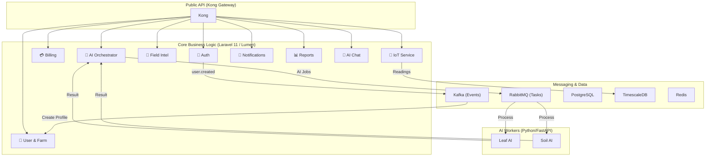

# GeoNutria Backend — Walkthrough

## 🏗️ The Architecture at a Glance



## 🚀 Key Features Implemented

### 1. **Secure & Reactive Identity**

- **Auth Service**: Manages JWT-based authentication.
- **Event-Driven UI**: When a user registers, a `user.created` event is broadcasted via **Kafka**. The **User Service** automatically builds a farm and profile in the background, ensuring zero latency for the user.

### 2. **The "Money Engine" (Credits)**

- **Billing Service**: Handles credit wallets with atomic precision.
- **Deduction logic**: Uses **Redis Locks** and DB Transactions to prevent race conditions (e.g., spending the same credit twice).
- **Payment Webhooks**: Integrated handlers for **Paymob (Egypt)** and **Moyasar (KSA)** to automatically convert payments into virtual credits.

### 3. **AI Task Orchestrator**

- **Async Execution**: The Orchestrator manages requests for 7 different AI tools.
- **RabbitMQ Integration**: Tasks are queued safely; workers (FastAPI) process them and report back via an internal callback, triggering user notifications.

### 4. **Precision Agriculture & IoT**

- **TimescaleDB Ingestion**: Optimized high-frequency ingestion for 11 environmental parameters.
- **Dashboard Aggregation**: The **Field Intelligence Service** acts as a "Backend-for-Frontend" (BFF), aggregating stats from all services to power the Home screen in a single request.

### 5. **AI Consultant & Reporting**

- **Contextual Chat**: The Chat service allows users to ask questions while injecting recent AI diagnoses into the prompt for smarter answers.
- **Automated Reports**: Generates PDF summaries of agricultural findings via the Lumen-based Report Service.

## 🛠️ How to Start the System

### 1. **Infrastructure**

Ensure you have Docker installed. Run the following to start the global infrastructure:

```bash
make infra-up
```

This starts PostgreSQL, TimescaleDB, Redis, RabbitMQ, Kafka, MinIO, and Kong.

### 2. **Environment Setup**

Each service has a `.env` template. You need to verify the `DB_HOST` and `REDIS_HOST` match your local network (usually `127.0.0.1` for local or the service name in Docker).

### 3. **Migrations**

Run migrations for each service to build the tables:

```bash
# Example for Auth Service
cd auth-service && php artisan migrate
```

### 4. **AI Workers**

Your Python AI models should be placed in `ai-services/*/models/`. The FastAPI wrappers are already configured to serve them.

## 📂 Project Organization

- `gateway/`: Kong API Gateway configuration.
- `shared/`: Configuration constants and shared protocols.
- `ai-services/`: Python wrappers for your ML models.
- `*-service/`: Individual Laravel/Lumen microservices.

---

**Implementation Finalized.** The backend is ready to serve the GeoNutria mobile app.
